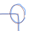

Shape recognition for Inkscape
===============================

This is an extension for the [Inkscape](https://inkscape.org/) drawing
program.

The extension allows to find and replace regular simple shapes (lines,
rectangle, circles or ellipses) from one or many hand drawn paths.

For each SVG path it is given, the following steps are performed :
- evaluating if the path is a full circle or ellipse
- else finding sequences of aligned points and replacing them by a simple segment.
- changing the segments angles to the closest remarkable angle (pi/2, pi/3, pi/6, etc...)
- eqalizing all segments lengths which are close to each other
- replacing 4 segments paths by a rectangle object if this makes sens (giving the correct rotation to the rectangle). 

Installation
============

Requirements
------------

There is one dependency : [numpy](http://www.numpy.org/).

On linux distributions, this most certainly can be find in your software center.

On windows or Mac, check the above website.

Install 
-------

On linux : copy the  `shapereco.py` and `shapereco.inx` into your
`$HOME/.config/inkscape/extensions/` directory.

On other systems, I'm not sure. Something equivalent should work ?

Usage
======

1. Draw 1 or several paths with the freehand tool
2. Select these paths
1. In the menu, choose "Extension" -> "Generate from path" -> "Shape
   recognition"
   
If you have draw a blue square and circle as below, you should obtain
   shapes as those in red 

 
